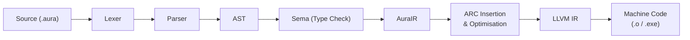

# Aura Compiler Architecture

> Status note (March 2026): this file is a roadmap/target architecture document. The currently implemented compiler/runtime in this repository is the TypeScript bytecode pipeline documented in `docs/SYNTAX_QUICKSTART.md`.

> *How Aura source becomes machine code.*

---

## 1. Pipeline Overview



| Stage | Responsibility | Output |
|---|---|---|
| **Lexer** | Tokenise source, handle indentation levels | Token stream |
| **Parser** | Build concrete syntax tree from tokens | CST → AST |
| **Sema** | Type inference, name resolution, borrow analysis | Typed AST |
| **AuraIR** | Lower AST to Aura's mid-level IR | SSA-form IR |
| **ARC Pass** | Insert retain/release, elide where provably safe | Optimised IR |
| **LLVM Codegen** | Emit LLVM IR, invoke LLVM optimisation passes | `.bc` / `.ll` |
| **Linker** | Link object files + stdlib into final binary | Executable |

---

## 2. Frontend — Written in Rust

The compiler frontend (`aurac`) is implemented in **Rust** for:

- Memory safety during compilation itself.
- Excellent performance on large codebases.
- Rich ecosystem (proc-macros, `logos` for lexing, `chumsky` for parsing).

### 2.1 Lexer

- Uses the `logos` crate for zero-copy tokenisation.
- Tracks indentation with a stack, emitting virtual `INDENT` / `DEDENT` tokens (Python-style).
- Handles string interpolation by switching to a sub-lexer within `"{ ... }"` sequences.

### 2.2 Parser

- Pratt parser for expressions (handles operator precedence cleanly).
- Recursive descent for statements and declarations.
- Produces an **Abstract Syntax Tree** (AST) with full source-span metadata for error reporting.
- Recovers from errors gracefully — continues parsing to report multiple diagnostics.

### 2.3 Semantic Analysis (Sema)

- **Name resolution:** Handles modules, imports, nested scopes.
- **Type inference:** Bidirectional Hindley-Milner extended with subtyping constraints.
- **Interface conformance:** Verifies that all `impl` blocks satisfy their interface contracts.
- **Lifetime analysis (lite):** Determines where ARC can be elided (single-owner, stack-only lifetimes).

---

## 3. Middle-End — AuraIR

AuraIR is a **typed, SSA-form** intermediate representation designed for Aura-specific optimisations before lowering to LLVM.

### 3.1 Key Passes

| Pass | Description |
|---|---|
| **ARC Insertion** | Inserts `arc_retain` / `arc_release` operations on reference-typed values. |
| **ARC Elision** | Removes retain/release pairs that provably have no effect (e.g., temporaries consumed in-scope). |
| **Region Promotion** | Groups allocations with matching lifetimes into arena regions. |
| **Devirtualisation** | Replaces interface dispatch with direct calls when the concrete type is known. |
| **Inlining Heuristic** | Inlines small functions (≤ 30 IR nodes) to reduce call overhead. |
| **Dead Code Elimination** | Removes unreachable code and unused bindings. |

### 3.2 ARC Optimisation Detail

```
╔══════════════════════════════════════════════════╗
║  Source:    let x = Foo()                        ║
║            use(x)                                ║
║            # x never escapes this scope          ║
║                                                  ║
║  Naive ARC:  arc_retain(x)                       ║
║              use(x)                              ║
║              arc_release(x)                      ║
║                                                  ║
║  Optimised:  use(x)       ← retain/release       ║
║              dealloc(x)     elided, direct free   ║
╚══════════════════════════════════════════════════╝
```

The compiler tracks an **escape analysis graph**. Values that provably never leave their defining scope are allocated on the **stack** with no ARC overhead at all.

---

## 4. Backend — LLVM

### 4.1 LLVM IR Generation

AuraIR maps to LLVM IR via the `inkwell` crate (safe Rust bindings for the LLVM C API).

| Aura Concept | LLVM Mapping |
|---|---|
| `Int`, `Float64` | `i64`, `double` |
| `String` | Pointer to ref-counted buffer (`{ i64, i64, ptr }`) |
| `class` instance | Heap-allocated via `malloc` + ARC metadata header |
| `struct` instance | Stack-allocated `%struct` |
| `fn` | LLVM function with standard calling convention |
| `async fn` | State-machine coroutine (LLVM coroutine intrinsics) |
| `interface` dispatch | vtable pointer (similar to C++ virtual) |

### 4.2 Optimisation Passes

Aura uses LLVM's `O2` pipeline by default:
- Scalar optimisation (SROA, GVN, LICM)
- Vectorisation (loop + SLP)
- Link-Time Optimisation (LTO) in release builds

### 4.3 Targets

| Tier | Platforms |
|---|---|
| **Tier 1** | x86_64 Linux, x86_64 macOS, x86_64 Windows |
| **Tier 2** | aarch64 Linux, aarch64 macOS (Apple Silicon) |
| **Tier 3** | WebAssembly (via `wasm32-unknown-unknown`) |

---

## 5. Build System & Package Manager — `aura`

The `aura` CLI serves as both the compiler driver and package manager.

```bash
aura new my-project          # Scaffold a new project
aura build                   # Compile (debug)
aura build --release         # Compile with optimisations + LTO
aura run                     # Build and execute
aura test                    # Run test suite
aura fmt                     # Format source code
aura lint                    # Run linter
aura add net.http            # Add a dependency
```

### 5.1 Project Structure

```
my-project/
├── aura.toml           # Project manifest (name, version, deps)
├── src/
│   └── main.aura       # Entry point
├── lib/
│   └── utils.aura      # Library modules
└── tests/
    └── test_utils.aura  # Test files
```

### 5.2 `aura.toml`

```toml
[project]
name = "my-project"
version = "0.1.0"
aura = "0.1"

[dependencies]
net.http = "1.2"
json     = "0.9"

[build]
target = "native"
opt-level = 2
```

---

## 6. Compilation Modes

| Mode | Flags | Behaviour |
|---|---|---|
| **Debug** | (default) | No optimisation, full debug symbols, bounds checking, ARC stats |
| **Release** | `--release` | `O2` + LTO, symbols stripped, ARC elision maximised |
| **Check** | `--check` | Type-check only, no codegen (fast feedback loop) |
| **Emit IR** | `--emit=llvm-ir` | Outputs `.ll` files for inspection |
