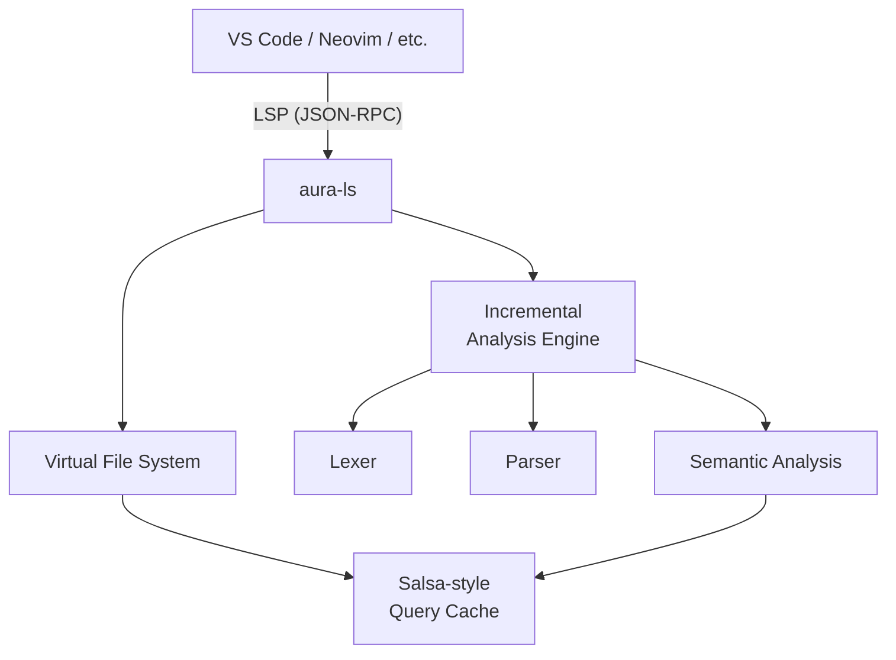

# IDE & Tooling Strategy

> Status note (March 2026): this file describes intended tooling direction. Current implemented editor support in this repo is the VS Code grammar/config under `editor/vscode` plus the TypeScript CLI/compiler in `compiler/`.

> *Making Aura a joy to write from day one.*

---

## 0. Current Implemented Support (No LSP)

The repository currently ships a VS Code-compatible extension at `editor/vscode` with:

- Syntax highlighting (TextMate grammar).
- File icons for `.aura`.
- Snippets for loops, OOP, constraints/measures, facets, and native collections.
- Non-LSP IntelliSense completions (keywords, builtins, snippets, and method completion on known collection types).
- Hover docs for Aura keywords.

Build and package:

```powershell
cd C:\Users\wwwab\Development\AURA\editor\vscode
powershell -ExecutionPolicy Bypass -File .\scripts\build-vsix.ps1
```

Install the generated `editor/vscode/aura-lang-0.1.0.vsix` in any VS Code-compatible IDE that supports VSIX extensions.

### 0.1 Current Quality Gates

From `compiler/`:

```powershell
npm run check:strict
npm run test
```

This runs:
- `check:all` (compiler build + all examples compile-check)
- `check:conformance` (`tests/conformance` golden tests + expected failures)

---

## 1. Language Server Protocol (LSP)

The **Aura Language Server** (`aura-ls`) implements the [LSP specification v3.17](https://microsoft.github.io/language-server-protocol/) to provide first-class editor support from alpha.

### 1.1 Implementation Language

`aura-ls` is implemented in **Rust**, sharing the compiler frontend crates (`lexer`, `parser`, `sema`). This guarantees that the LSP and the compiler always agree on semantics.

### 1.2 Architecture



**Key design:** `aura-ls` uses a **Salsa-style incremental computation** framework. When a file changes, only the affected queries are recomputed — not the entire project. This keeps response times under **50 ms** even for large codebases.

### 1.3 Supported LSP Capabilities

| Capability | Description | Priority |
|---|---|---|
| `textDocument/completion` | Context-aware autocompletion with type-driven ranking | **P0** |
| `textDocument/hover` | Type info, documentation, inferred types on hover | **P0** |
| `textDocument/definition` | Go-to-definition (cross-module) | **P0** |
| `textDocument/references` | Find all references | **P0** |
| `textDocument/rename` | Project-wide rename | **P0** |
| `textDocument/diagnostic` | Real-time error & warning diagnostics | **P0** |
| `textDocument/signatureHelp` | Parameter hints while typing | **P1** |
| `textDocument/codeAction` | Quick fixes, auto-imports, implement interface | **P1** |
| `textDocument/formatting` | Full-file formatting via `aura fmt` | **P1** |
| `textDocument/inlayHint` | Inferred type hints, parameter names | **P1** |
| `textDocument/semanticTokens` | Semantic highlighting (contextual colours) | **P2** |

### 1.4 Performance Targets

| Metric | Target |
|---|---|
| Completion latency | < 50 ms |
| Diagnostics after keystroke | < 100 ms |
| Go-to-definition | < 30 ms |
| Memory (100K LOC project) | < 300 MB |
| Startup time | < 500 ms |

---

## 2. VS Code Extension

### 2.1 Extension Components

```
editor/vscode/
├── package.json                    # Extension manifest
├── language-configuration.json     # Brackets, comments, folding
├── syntaxes/
│   └── aura.tmLanguage.json        # TextMate grammar
├── images/
│   └── aura-icon.png               # File icon
└── src/
    └── extension.ts                # Activates LSP client
```

### 2.2 Features

1. **Syntax Highlighting** — TextMate grammar for immediate keyword/operator colouring.
2. **Semantic Highlighting** — LSP-driven token classification (e.g., distinguish types from variables).
3. **Snippets** — Common patterns: `fn`, `class`, `impl`, `match`, `async fn`.
4. **File Icon** — Custom `.aura` file icon in the explorer.
5. **Task Integration** — `aura build`, `aura test`, `aura run` as VS Code tasks.
6. **Problem Matcher** — Parse `aurac` compiler output into the Problems panel.

### 2.3 TextMate Grammar Overview

The grammar (`aura.tmLanguage.json`) provides:

- **Keywords:** `let`, `var`, `fn`, `class`, `interface`, `trait`, `impl`, `async`, `await`, etc.
- **Control flow:** `if`, `elif`, `else`, `for`, `while`, `match`, `case`, `return`.
- **Types:** Capitalised identifiers following `:` or `->`.
- **Strings:** Double-quoted with `{expr}` interpolation support.
- **Comments:** `#` line comments and `## ... ##` block comments.
- **Operators:** All arithmetic, comparison, and Aura-specific operators.

---

## 3. Formatter — `aura fmt`

### 3.1 Design Principles

- **Zero config.** One canonical style — no options, no debates.
- **Deterministic.** Same input always produces same output.
- **Fast.** Formats 100K LOC in under 1 second.

### 3.2 Style Rules

| Rule | Value |
|---|---|
| Indentation | 4 spaces |
| Max line length | 100 characters |
| Trailing commas | Always in multi-line constructs |
| Blank lines between functions | 1 |
| Blank lines between classes | 2 |
| Import sorting | Alphabetical, grouped (stdlib → deps → local) |

---

## 4. Linter — `aura lint`

### 4.1 Built-in Rules

| Rule | Severity | Description |
|---|---|---|
| `unused-variable` | Warning | `let x` never read |
| `unused-import` | Warning | Imported module never used |
| `dead-code` | Warning | Unreachable code after `return` |
| `shadowed-name` | Info | Variable shadows outer scope |
| `mutable-not-mutated` | Warning | `var` declared but never modified → suggest `let` |
| `unsafe-unwrap` | Warning | Force-unwrap `!` without nil check |
| `large-function` | Info | Function exceeds 50 lines |
| `missing-doc` | Info | Public API lacks doc comment |

### 4.2 Custom Rules

Users can define project-specific lint rules in `aura.toml`:

```toml
[lint]
deny = ["unsafe-unwrap"]
allow = ["large-function"]
```

